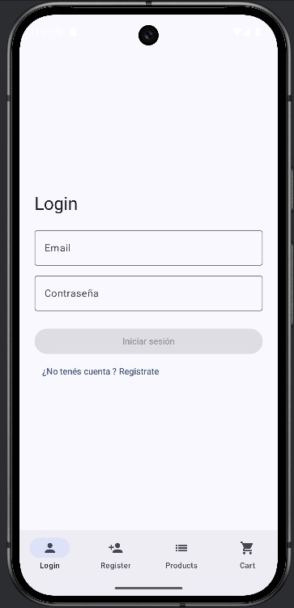
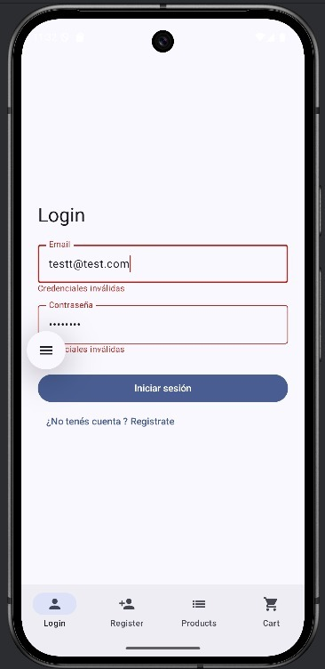
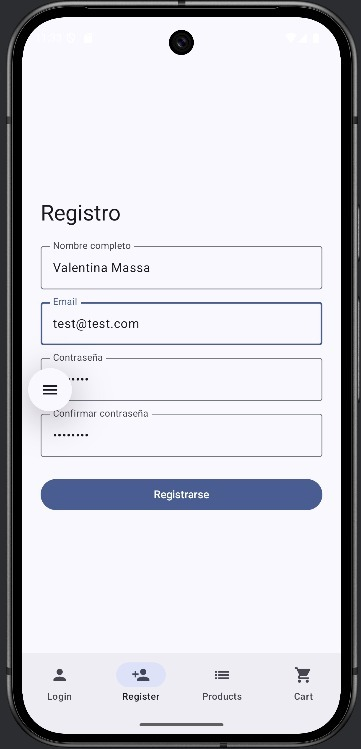
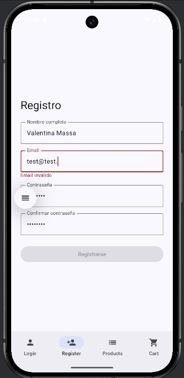
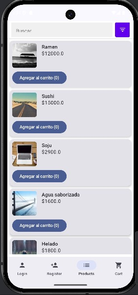
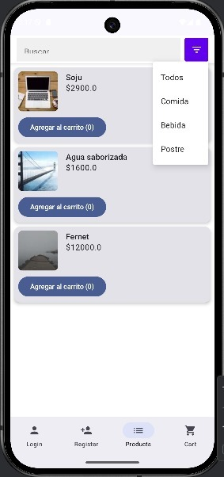
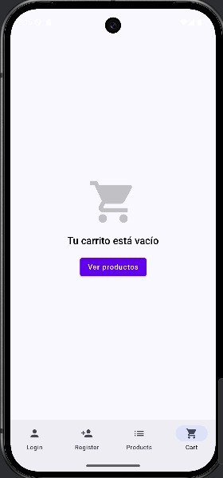

## Peya Ecommerce App 🛒

Dado que enfrenté problemas de incompatibilidad de dependencias relacionadas con *Room* y *Hilt*, presento el bloque estable de mi aplicación, que hasta el momento incluye las siguientes funcionalidades principales:

- *Login*: Autenticación básica de usuario.  
- *Registro*: Registro de nuevos usuarios.  
- *Listado de Productos*: Visualización dinámica de productos disponibles.  
- *Carrito de Compras (sin persistencia con Room)*: Funcionalidad completa, aunque sin almacenamiento persistente.

---

## 📸 Capturas de Pantalla

---

## 📝 Notas Finales
- La aplicación se encuentra en *desarrollo activo*. Debido a mi ausencia en el periodo disponible para la entrega final de este trabajo integrador, *todo feedback que me ayude a mejorar mi proyecto más allá de este curso será muy bien recibido*.
- Agradezco el tiempo que puedas dedicar para probar mi proyecto o brindarme sugerencias que me ayuden a continuar desarrollando esta app. Es un proyecto muy interesante para terminar su construcción, y cualquier orientación me permitirá convertirlo en un producto funcional y escalable.

---
